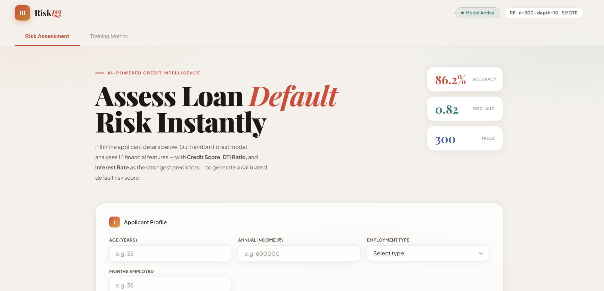
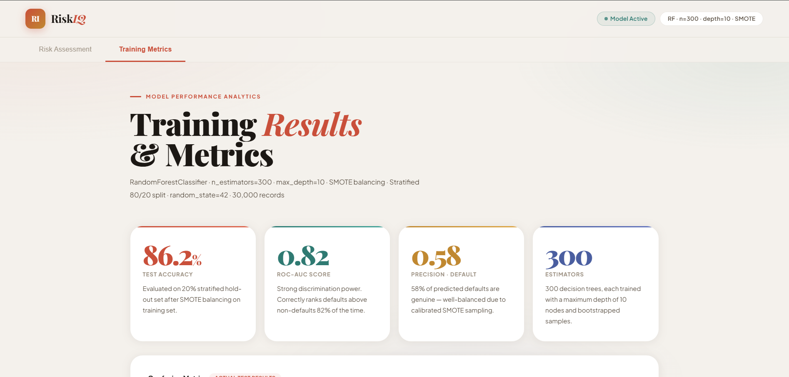

# 🏦 RiskIQ — AI Loan Default Risk Scoring System


> An AI-powered web application that predicts loan default risk using a trained Random Forest classifier. Enter an applicant's financial details and instantly receive a calibrated default probability score with key risk driver analysis.

---

## 🌐 Live Demo

🔗 **[https://loan-risk-app.onrender.com](https://loan-risk-app-2.onrender.com)**

> ⚠️ Free tier may take 30–60 seconds to wake up on first visit.

---
## 📸 Screenshots

### Risk Assessment


### Training Metrics


> 💡 Replace the placeholder images above with real screenshots of your app.

---

## ✨ Features

- 🤖 **Real ML Predictions** — Random Forest model trained on 30,000 loan records
- 📊 **Risk Gauge & Score** — Animated dial showing Low / Medium / High risk
- 🔍 **Key Risk Drivers** — Visual breakdown of the 6 most influential factors
- 📈 **Training Metrics Tab** — ROC curve, confusion matrix, feature importance charts
- 🎨 **Modern UI** — Glass-morphism design with smooth animations
- 📱 **Responsive** — Works on desktop and mobile

---

## 🧠 Model Details

| Property | Value |
|---|---|
| Algorithm | Random Forest Classifier |
| Training Records | 30,000 |
| Test Accuracy | **86.2%** |
| ROC-AUC Score | **0.82** |
| Number of Trees | 300 |
| Max Depth | 10 |
| Class Balancing | SMOTE (training set only) |
| Train/Test Split | 80% / 20% Stratified |

### Top Predictive Features
1. **Credit Score** — 30% importance
2. **DTI Ratio** — 18% importance
3. **Interest Rate** — 12% importance
4. **Annual Income** — 10% importance
5. **Employment Type** — 8% importance
6. **Months Employed** — 6% importance

---

## 🗂️ Project Structure

```
loan-risk-app/
│
├── Frontend.py                 # Flask backend — routes & ML prediction logic
├── loan_risk_frontend.html     # Frontend UI — all HTML, CSS, JS in one file
├── loan_model.pkl              # Trained Random Forest model
├── model_columns.pkl           # Feature column names from training
├── requirements.txt            # Python dependencies
├── Procfile                    # Gunicorn start command for Render
└── README.md                   # You are here!
```

---

## 🚀 Run Locally

### 1. Clone the repository
```bash
git clone https://github.com/YOUR_USERNAME/loan-risk-app.git
cd loan-risk-app
```

### 2. Install dependencies
```bash
pip install -r requirements.txt
```

### 3. Run the Flask server
```bash
python Frontend.py
```

### 4. Open in browser
```
http://127.0.0.1:5000
```

---

## 📡 API Reference

### `POST /predict`

Accepts applicant data and returns a default risk prediction.

**Request Body (JSON):**
```json
{
  "age": 35,
  "income": 600000,
  "employment": "full",
  "months_emp": 36,
  "loan_amount": 500000,
  "loan_term": 36,
  "interest_rate": 8.5,
  "credit_score": 680,
  "credit_lines": 4,
  "dti": 0.35,
  "mortgage": 0,
  "cosigner": 0
}
```

**Employment values:** `full` · `part` · `self` · `unemployed`

**Response (JSON):**
```json
{
  "probability": 0.312,
  "risk_percent": 31.2,
  "prediction": 0,
  "risk_level": "Medium Risk",
  "decision": "Approve"
}
```

### `GET /model-info`

Returns metadata about the loaded model.

```json
{
  "model_type": "RandomForestClassifier",
  "n_estimators": 300,
  "max_depth": 10,
  "n_features": 14,
  "feature_names": ["Age", "Income", "LoanAmount", "..."],
  "classes": ["0", "1"]
}
```

---

## 🛠️ Tech Stack

| Layer | Technology |
|---|---|
| Backend | Python, Flask |
| ML Model | scikit-learn (RandomForestClassifier) |
| Data Processing | pandas, NumPy |
| Model Persistence | joblib |
| Frontend | HTML5, CSS3, Vanilla JavaScript |
| Charts | Chart.js 4.4 |
| Fonts | Google Fonts (Playfair Display, Plus Jakarta Sans) |
| Deployment | Render (free tier) |
| Version Control | GitHub |

---

## ⚙️ Input Fields Explained

| Field | Description | Range |
|---|---|---|
| Age | Applicant age in years | 18 – 90 |
| Annual Income | Yearly income in ₹ | Any positive value |
| Employment Type | Job category | Full-time / Part-time / Self-employed / Unemployed |
| Months Employed | Duration at current job | 0+ |
| Loan Amount | Requested loan in ₹ | Any positive value |
| Loan Term | Repayment period in months | 6 – 360 |
| Interest Rate | Annual interest rate | 1% – 36% |
| Credit Score | CIBIL / credit bureau score | 300 – 850 |
| Num. Credit Lines | Open credit accounts | 0+ |
| DTI Ratio | Debt-to-Income ratio | 0.00 – 1.00 |
| Has Mortgage | Existing mortgage | Yes / No |
| Has Co-Signer | Loan co-signer present | Yes / No |

---

## 📊 Model Performance

```
Classification Report:
                  Precision   Recall   F1-Score   Support
  0 (No Default)    0.90       0.92      0.91      4,682
  1 (Default)       0.58       0.62      0.60      1,318
  Macro Avg         0.74       0.77      0.76      6,000
  Weighted Avg      0.83       0.86      0.85      6,000

Confusion Matrix:
  True Negative:  4,318  |  False Positive:  364
  False Negative:   473  |  True Positive:   845
```

---

## 🔮 Future Improvements

- [ ] Add user authentication for loan officers
- [ ] Export predictions as PDF report
- [ ] Batch prediction via CSV upload
- [ ] Integrate XGBoost / LightGBM for better AUC
- [ ] Add SHAP values for explainability
- [ ] Connect to a real database for prediction history

---

## 👨‍💻 Author

**Abuthahir**
- GitHub: [@ABUTHAHIR](https://github.com/ABUTHAHIR)

---

## 📄 License

This project is licensed under the **MIT License** — feel free to use, modify, and distribute.

---

## 🙏 Acknowledgements

- [scikit-learn](https://scikit-learn.org/) for the Random Forest implementation
- [Chart.js](https://www.chartjs.org/) for beautiful charts
- [Render](https://render.com/) for free hosting
- [Google Fonts](https://fonts.google.com/) for typography

---

<p align="center">Made with ❤️ for AI-powered credit intelligence</p>
